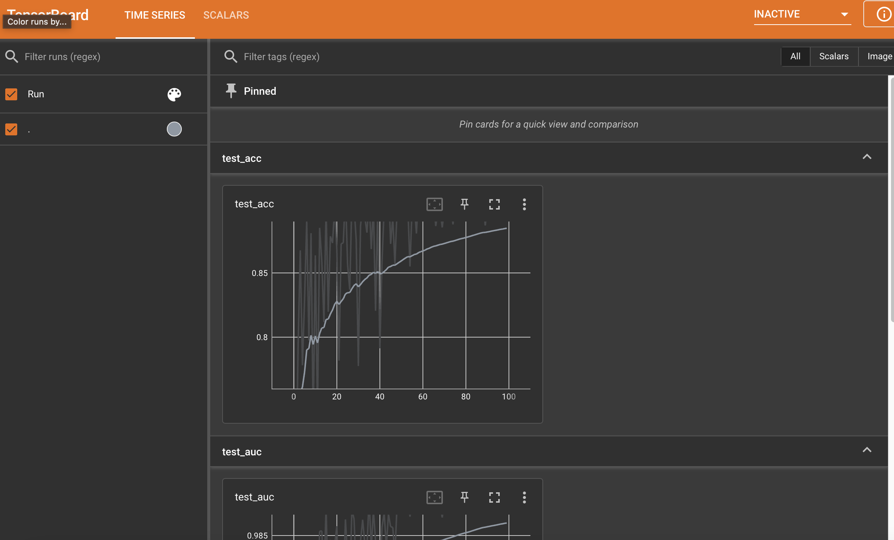
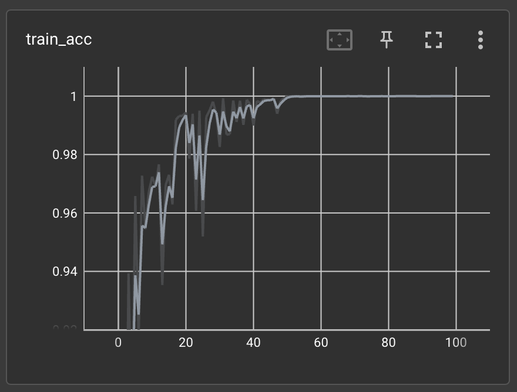
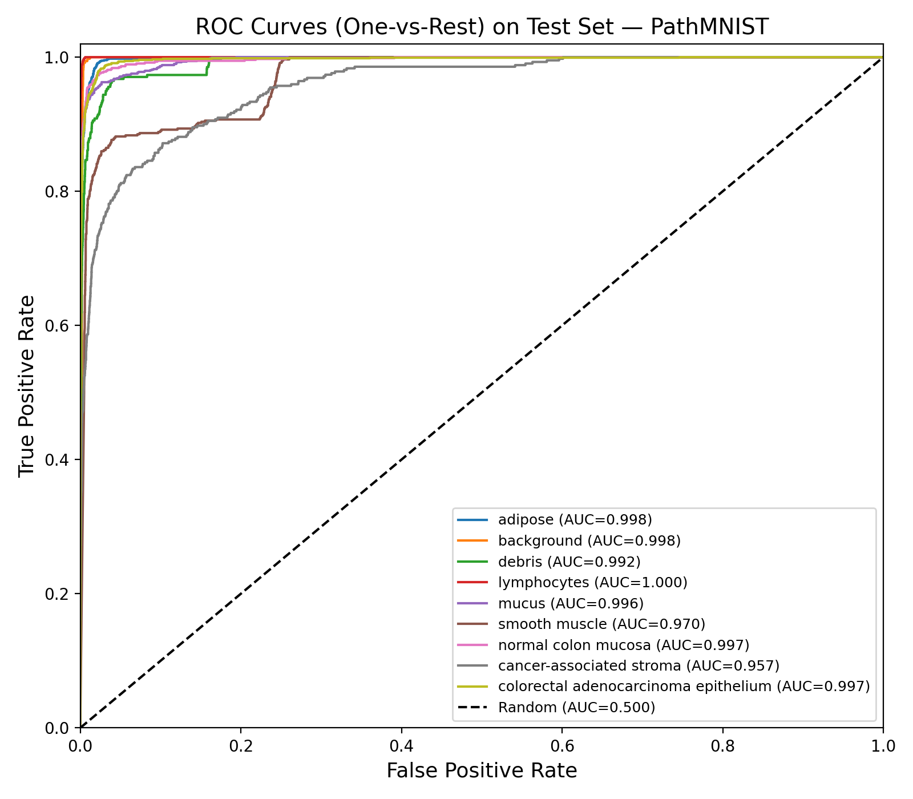

# MedMNIST Training Assignment

> **Submission:** Complete this assignment as a markdown file (`.md`) and submit it to your GitHub account.

---

## Task 1: Run Training

Run the training steps outlined in the instructions above. You may use an AI assistant if needed.

---

## Task 2: Training Configuration Analysis

### What learning rates are used in the training?

We use `0.001` as the initial learning rate. It decays to `0.0001` at epoch 50 and `0.00001` at epoch 75.

### What is the train/val/test split of the dataset (provide sample counts)?

Using the PathMNIST dataset:

| Split      | Sample Count |
|------------|-------------|
| Training   | 89,996      |
| Validation | 10,004      |
| Test       | 7,180       |

### What are the dimensions of the model input per batch?

With batch size = 128, the input tensor shape is:

```
(128, 3, 28, 28)
```
*(batch_size, channels, height, width)*

### What is the dimension of the model output during training? What does it represent?

```
(128, 9)  →  (batch_size, n_classes)
```

Each row is a vector of logits over 9 classes, one per image in the batch.

### What type of task is this? What loss function is used?

This is a **multi-class image classification** task. The loss function used is **Cross-Entropy Loss**.

### How many files are generated after training? Where are they located and what do they contain?

The following files are generated:

| File | Description |
|------|-------------|
| `best_model.pth` | Best model checkpoint (saved when validation AUC improves) |
| `pathmnist_log.txt` | Train/val/test AUC and accuracy logs per epoch |
| TensorBoard results | Metrics (loss, AUC, accuracy) for visualization |
| Evaluation `.csv` | Per-sample evaluation results on the test set |

---

## Task 3: Training Statistics Visualization

### Where are the training statistics stored? How do you visualize them?

The training statistics are stored in:

```
outputs/PathMNIST_ResNet18/pathmnist/260220_131845/Tensorboard_Results
```

To visualize them, run:

```bash
tensorboard --logdir outputs/PathMNIST_ResNet18/pathmnist/260220_131845/Tensorboard_Results
```

### How many curves are displayed? What do they represent?

There are **9 curves** in total:

| Curve | Description |
|-------|-------------|
| `train_loss` | CrossEntropyLoss averaged over training batches |
| `train_auc` | AUC computed on the training set |
| `train_acc` | Fraction of correctly predicted training samples |
| `val_loss` | CrossEntropyLoss averaged over validation batches |
| `val_auc` | AUC computed on the validation set |
| `val_acc` | Fraction of correctly predicted validation samples |
| `test_loss` | CrossEntropyLoss averaged over test batches |
| `test_auc` | AUC computed on the test set |
| `test_acc` | Fraction of correctly predicted test samples |

### How does the learning rate schedule correlate with the behavior of the curves?



In early training (high LR), accuracy and loss fluctuate and oscillate significantly. As the learning rate drops at epochs 50 and 75, the curves stabilize and plateau, reflecting smaller, more conservative weight updates.

### What observations can you make about the curve trends?

The curves are **generally decreasing (loss) / increasing (accuracy & AUC)** but exhibit fluctuation due to the stochastic nature of mini-batch sampling — each batch introduces variance that causes step-to-step noise, even as the overall trend improves.

---

## Task 4: AUC Metric Analysis

### Is AUC used in this training script? How is it applied?

Yes. AUC is explicitly computed via `evaluator.evaluate(...)`, which returns both AUC and accuracy for the train, validation, and test sets.

Importantly, **validation AUC is used for model selection**: whenever the current validation AUC exceeds the previous best, the model weights are saved as the new best checkpoint. This means AUC is not merely a reporting metric — it directly drives model selection.

### What curve does "AUC" refer to?

AUC refers to the area under the **ROC (Receiver Operating Characteristic) curve**. It represents the probability that a randomly chosen positive sample is ranked higher than a randomly chosen negative sample by the model.




---

## Task 5: Bonus Challenge

Adapt the code to train a classification model on the **DermaMNIST** dataset instead of PathMNIST.

Simply run:

```bash
python train.py --data_flag dermamnist
```